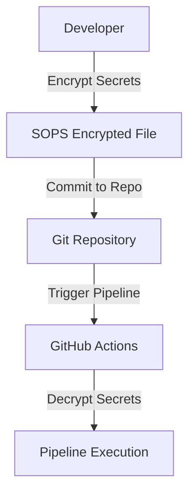

# PoC: Storing Secrets Encrypted in Git with SOPS

A proof of concept (PoC) demonstrating how to securely store secrets in a Git repository using SOPS and decrypt them during pipeline execution with GitHub Actions.

---

## Introduction

This project uses [SOPS](https://github.com/getsops/sops) to encrypt sensitive information in Git repositories. The PoC showcases a secure and automated workflow for managing secrets by leveraging SOPS' encryption capabilities and GitHub Actions.

---

## Diagram



---

## Features

- **Secure Secret Storage:** Encrypt secrets directly within your Git repository to maintain confidentiality.
- **Automated Decryption:** Use GitHub Actions to decrypt secrets during CI/CD pipeline execution securely.
- **Flexible Encryption:** SOPS supports multiple backends, including AWS KMS, GCP KMS, and PGP.
- **Easy Integration:** Minimal setup required to integrate SOPS into existing workflows.

---

## Useful Links

- [SOPS GitHub Repository](https://github.com/getsops/sops)
- [ITNEXT Article: Store Passwords in Git with SOPS](https://itnext.io/store-passwords-in-git-with-sops-251810869e10)

---

## How to Run

1. **Install SOPS:**
   Follow the installation instructions from the [SOPS GitHub Repository](https://github.com/getsops/sops).

2. **Encrypt a file:**
   ```bash
   sops --encrypt --encrypted-regex '^(password|secret)$' secrets.yaml > secrets.enc.yaml
   ```

3. **Commit the encrypted file to the repository:**
   ```bash
   git add secrets.enc.yaml
   git commit -m "Add encrypted secrets"
   ```

4. **Set up GitHub Actions for decryption:**
   - Configure SOPS to use your desired encryption backend (e.g., AWS KMS, GCP KMS, or PGP).
   - Add the necessary keys to your GitHub repository as secrets.
   - Use a GitHub Actions workflow to decrypt and use the secrets during pipeline execution.

5. **Run the pipeline:**
   Push changes to trigger the GitHub Actions workflow and observe the decryption process during execution.

---

## License

This project is licensed under the MIT License. Please take a look at the [LICENSE](LICENSE) file for details.
